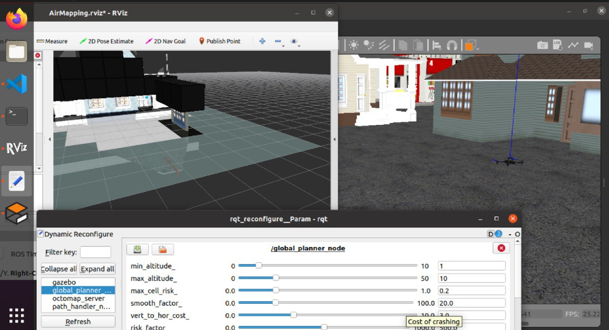
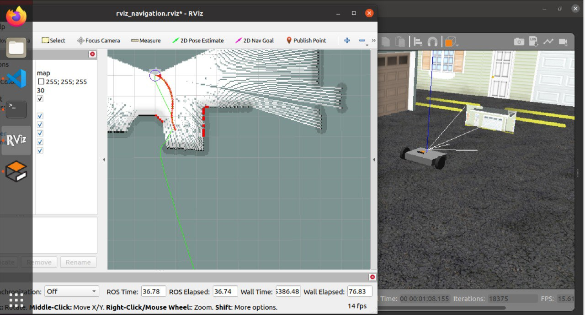
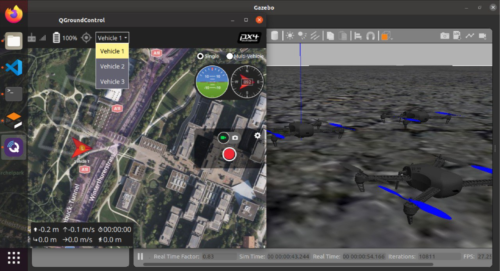
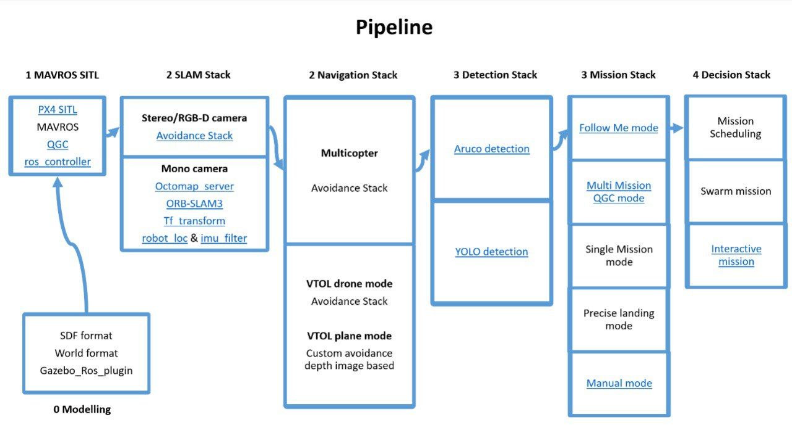
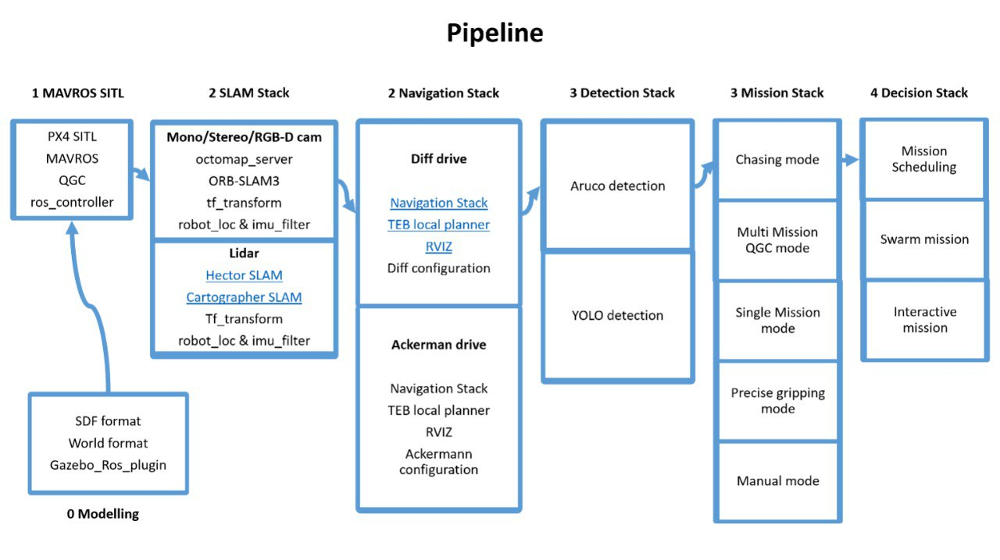

# This is the project contains Gazebo SITL control for multiple vehicles

# Inroduction

This project contains autonomous UAVs and cars with PX4 autopilot software.
The folder is provided SITL(Software in the loop), HITL(Hardware in the loop) and folder for the real autonomous too.

Some realization in this project:

- custom model and configuration in Gazebo for PX4
- Q Ground Control compatible and automatic mission accomplishment
- Atomatic mission with avoidance algorithms
- Swarm mission

Examples:

UAV with avoidance module


Ground vehicle with avoidance module



UAV or ground vehicle swarm



UAV pipeline



Ground vehicle pipeline



# Installing Guide

In this txt file manually change the the ubuntu name for your pc. In this example is "vboxuser"

If the problem appeard with permission for user:
open the terminal:

```
su root
nano /etc/sudoers
```
Write in there and save it
```
vboxuser ALL=(ALL:ALL) ALL
%vboxuser ALL=(ALL) ALL
```
Close the teminal. Then in the new terminal run

### Install ROS
```
sudo apt install git python3-pip -y
```
```
mkdir -p ~/catkin_ws/src
cd ~/catkin_ws/src
git clone https://github.com/TPODAvia/ROS1-installation.git
chmod +x ROS1-installation/ROS.sh
sudo ./ROS1-installation/ROS.sh
echo "source /opt/ros/noetic/setup.bash" >> ~/.bashrc
source ~/.bashrc
source /opt/ros/noetic/setup.bash
```
```
sudo apt install build-essential git python3-pip python3-rosdep -y
sudo apt install libpcl1 ros-noetic-octomap-* -y
```
### Install ORB-SLAM dependencies
```
sudo apt install libeigen3-dev -y
sudo apt install ros-noetic-hector-trajectory-server -y
```

```
I',m trying to fix orb slam catkin_make error:

Hey all, just tried 3.3.2 (2017 Jan) downgraded from 3.4 and its working.
1: in terminal remove your current eigen3 folder with "sudo rm -rf /usr/local/include/eigen3"
2. Download and extract this -> http://bitbucket.org/eigen/eigen/get/3.3.2.tar.bz2
3. cd into the extracted folder and in terminal "mkdir build && cd build" then "cmake .." then "sudo make install"


cd ~
git clone https://github.com/stevenlovegrove/Pangolin.git
cd Pangolin
mkdir build && cd build
cmake ..
make
sudo make install
sudo ldconfig
```

### Install YOLOv8 dependencies

```
sudo apt-get install python3-scipy -y
sudo apt-get install ros-noetic-vision-msgs -y
sudo apt-get install ros-noetic-geometry-msgs -y
sudo apt-get install ros-noetic-usb-cam -y
```

### Install the workspace
```
cd ~/catkin_ws
catkin_make
echo "source ~/catkin_ws/devel/setup.bash" >> ~/.bashrc
source ~/.bashrc
```
```
cd ~/catkin_ws/src
git clone https://github.com/thien94/orb_slam3_ros.git
cd ../
catkin_make

```
```
cd ~/catkin_ws/src

git clone https://github.com/TPODAvia/yolov8_ros.git

git init
git remote add origin http://git.promcars.ru/promavto-drone/px4-repository.git
git pull origin main
```

Restart the PC then continue

```
cd ~/catkin_ws
source /opt/ros/noetic/setup.bash
sudo rosdep init
```
```
rosdep update
rosdep install --from-paths src --ignore-src -y
```
```
sudo /usr/bin/python3 -m pip install -r ~/catkin_ws/src/requirements.txt
sudo /usr/bin/python3 -m pip install -r ~/catkin_ws/src/yolov8_ros/requirements.txt
```
### Install PX4-Autopilot
```
git clone --recursive --depth 1 --branch v1.12.3 https://github.com/PX4/PX4-Autopilot.git ~/PX4-Autopilot

cd ~/catkin_ws/src/PX4-Autopilot/Tools/setup
sudo ./ubuntu.sh
```
go to the .barcsh and add at the end files:

source /opt/ros/noetic/setup.bash
source ~/catkin_ws/devel/setup.bash

. ~/PX4-Autopilot/Tools/setup_gazebo.bash ~/PX4-Autopilot ~/PX4-Autopilot/build/px4_sitl_default

export GAZEBO_MODEL_PATH=${GAZEBO_MODEL_PATH}:~/catkin_ws/src/PX4-Avoidance/avoidance/sim/models:~/catkin_ws/src/PX4-Avoidance/avoidance/sim/worlds

export ROS_PACKAGE_PATH=${ROS_PACKAGE_PATH}:~/PX4-Autopilot


```
pip3 install --user toml
```
```
sudo /opt/ros/noetic/lib/mavros/install_geographiclib_datasets.sh
cd ~/catkin_ws
source devel/setup.bash
catkin_make
```
if catkin_make fails just catkin_make again :)

### Install QGroundControl
```
sudo usermod -a -G dialout $USER
sudo apt-get remove modemmanager -y
sudo apt install gstreamer1.0-plugins-bad gstreamer1.0-libav gstreamer1.0-gl -y
sudo apt install libqt5gui5 -y
sudo apt install libfuse2 -y
xdg-open https://d176tv9ibo4jno.cloudfront.net/latest/QGroundControl.AppImage
cd
```
wait for some second
```
cp ./Downloads/QGroundControl.AppImage ~/QGroundControl.AppImage
chmod +x ./QGroundControl.AppImage
```

Fixing Octomap server problem
```
sudo apt install libopencv-dev python-jinja2 protobuf-compiler -y
export GAZEBO_MODEL_PATH=${GAZEBO_MODEL_PATH}:~/catkin_ws/src/avoidance/sim/models
export QT_X11_NO_MITSHM=1
```
### Install SITL enviroment
And this is the final step
```
cd ~/PX4-Autopilot
export GAZEBO_RESOURCE_PATH=/usr/share/gazebo-11
make px4_sitl gazebo
```
Close the gazebo simulation then restart your Ubuntu

# Starting Guide

### 1) Now the enviroment is done. Test the sdf models first.

Go to the catkin_ws first
```
cd ~/catkin_ws
```
In the terminal 1 run:
```
roscore
```
run the launch file with your defined vehicle
In the terminal 2 run:
```
source devel/setup.bash 
roslaunch px4_sim 0launch_model_only.launch
```
You can change the vehicle type <arg name="vehicle" default="r1_rover"/>
Now, If everything is fine close all and moving to the next step.

### 2) Run with PX4 SITL.
In the terminal 1 run:
```
roscore
```
In the terminal 2 run:
```
source devel/setup.bash 
roslaunch px4_sim 1mavros_posix_sitl.launch
```

Remember that you can change the vehicle type.
<arg name="vehicle" default="vector"/>
Open Qground Control(QGC) or run ./QGroundControl.AppImage

``Note: for r1_rover you need to change some parameters in QGC. Now you can run a PX4 vehicle in Gazebo enviroment.``

### 3) Run the predefined mission

In QGC you can add a predefined mission in the path ~/px4_sim/mission and run the mission as usual.

### 4) Run in mission mode with mavros.
In the terminal 1 run:
```
roscore
```
In the terminal 2 run:
```
source devel/setup.bash 
roslaunch px4_sim 1mavros_posix_sitl.launch
```
Now go to the path ../px4_sim/src you need to get the permision to all pythons files. I mean chmod +x to all python file in the /src path.

Example: chmod +x control_vel.py

In the terminal 3 run:
```
source devel/setup.bash
rosrun mavros mavsys mode -c OFFBOARD
rosrun mavros mavsafety arm
rosrun px4_sim wind.py
rosrun px4_sim control_vel.py
rosrun px4_sim mavros_offboard_posctl_test.py
```
``Note: others python scripts is experimental. If the OFFBOARD is running, you won't be able to run a QGC mission plan.``

The option is to run launch file instead of python node.
In the terminal 3 run: (Options)
```
roslaunch px4_sim 3mission_multi_offb.launch
```
Now, If everything is fine close all and moving to the next step.

### 5) Run the SLAM Navigation
In the terminal 1 run:
```
roscore
```
For air vehicle run:
In the terminal 2 run:
```
roslaunch px4_sim 2obs_avoidance_air.launch
```

For ground vehicle run:
In the terminal 2 run: (Option)
```
roslaunch px4_sim 2obs_avoidance_ground2.launch
```
In the terminal 3 run:
```
source devel/setup.bash
rosrun mavros mavsys mode -c OFFBOARD
rosrun mavros mavsafety arm
```

### 6) Run ORB-SLAM navigation
In one terminal:
```
roslaunch orb_slam3_ros euroc_mono_inertial.launch
```
In another terminal:
```
rosbag play MH_01_easy.bag
```

Note: MH_01_easy cab be download here: http://robotics.ethz.ch/~asl-datasets/ijrr_euroc_mav_dataset/machine_hall/MH_01_easy/MH_01_easy.bag
    
### 7) Run multiple UAV with mavros.
In the terminal 1 run:
```
roslaunch px4_sim 4multi_uav_mavros_sitl.launch
```
Still in development...

# HITL simulations

### Adding custom airframes
You can create custom airframe for HITL simulations and save them in airframe_hitl folder. Names of created airframe file should consist of number code followed by model name (e.g. 6011_typhoon_h480). After run in terminal: 

```
ln -fs ~/catkin_ws/src/px4_sim/airframes_hitl/* ~/PX4-Autopilot/build/px4_sitl_default/etc/init.d-posix/airframes/
```

### Enabling motors in hitl
By default motors output is blocked in hitl mode. To unblock it, run in terminal:

```
cd ~/catkin_ws/src/px4_sim/hitl_setup/
./hitl_setup
```
Follow the instructions of the script to achieve the desired state of operation of the motors.

### Building PX4 Software
To apply changes ypu need to build and upload px4 firmware onto flight-controller board. To build for NuttX- or Pixhawk- based boards, navigate into the PX4-Autopilot directory and then call `make` with the build target for your board.
For example, to build for Pixhawk 4 hardware you could use the following command:

```
cd PX4-Autopilot
make px4_fmu-v5_default
```
A successful run will end with output similar to:

```
-- Build files have been written to: /home/youruser/src/PX4-Autopilot/build/px4_fmu-v4_default
[954/954] Creating /home/youruser/src/PX4-Autopilot/build/px4_fmu-v4_default/px4_fmu-v4_default.px4
```
The first part of the build target `px4_fmu-v4` indicates the firmware for a particular flight controller hardware. The following list shows the build commands for the [Pixhawk standard](https://docs.px4.io/main/en/flight_controller/autopilot_pixhawk_standard.html) boards:

-Holybro Pixhawk 6X (FMUv6X): `make px4_fmu-v6x_default`

-Holybro Pixhawk 6C (FMUv6C): `make px4_fmu-v6c_default`

-Holybro Pix32 v6 (FMUv6C): `make px4_fmu-v6c_default`

-Holybro Pixhawk 5X (FMUv5X): `make px4_fmu-v5x_default`

-Pixhawk 4 (FMUv5): `make px4_fmu-v5_default`

-Pixhawk 4 Mini (FMUv5): `make px4_fmu-v5_default`

-CUAV V5+ (FMUv5): `make px4_fmu-v5_default`

-CUAV V5 nano (FMUv5): `make px4_fmu-v5_default`

-Pixracer (FMUv4): `make px4_fmu-v4_default`

-Pixhawk 3 Pro: `make px4_fmu-v4pro_default`

-Pixhawk Mini: `make px4_fmu-v3_default`

-Pixhawk 2 (Cube Black) (FMUv3): `make px4_fmu-v3_default`

-mRo Pixhawk (FMUv3): `make px4_fmu-v3_default` (supports 2MB Flash)

-Holybro pix32 (FMUv2): `make px4_fmu-v2_default`

-Pixfalcon (FMUv2): `make px4_fmu-v2_default`

-Dropix (FMUv2): `make px4_fmu-v2_default`

-Pixhawk 1 (FMUv2): `make px4_fmu-v2_default`

-Pixhawk 1 with 2 MB flash: `make px4_fmu-v3_default`


Build commands for non-Pixhawk NuttX fight controllers (and for all other-boards) are provided in the documentation for the individual [flight controller boards](https://docs.px4.io/main/en/flight_controller/).


## Note 
The `_default` suffix is the firmware _configuration_. This is optional (i.e. you can also build using `make px4_fmu-v4`, `make bitcraze_crazyflie`, etc.).
##

### Uploading Firmware (Flashing the board)
Append `upload` to the make commands to upload the compiled binary to the autopilot hardware via USB. For example:
```
make px4_fmu-v4_default upload
```
A successful run will end with this output:
```
Erase  : [====================] 100.0%
Program: [====================] 100.0%
Verify : [====================] 100.0%
Rebooting.

[100%] Built target upload
```
### Setting up HITL
Select Airframe. To do this open **Setup --> *Airframes**
Select a compatible airframe you want to test. Generally you'll select _HILStar_ for Fixed Wing/X-Plane simulator and a _HIL QuadCopter_ option for copters (and jMAVSim or Gazebo). Then click **Apply and Restart** on top-right of the _Airframe_ _Setup_ page.


Calibrate your RC or Joystick, if needed. You can control simulation with a QGroundControl Virtual Joystick aswell.
Then setup **UDP** connection. Under the _General_ tab of the settings menu, uncheck all _AutoConnect_ boxes except for **UDP**. 


Now you can start gazebo HITL simulation. You should be able to use QGroundControl to run missions and otherwise control the vehicle.

