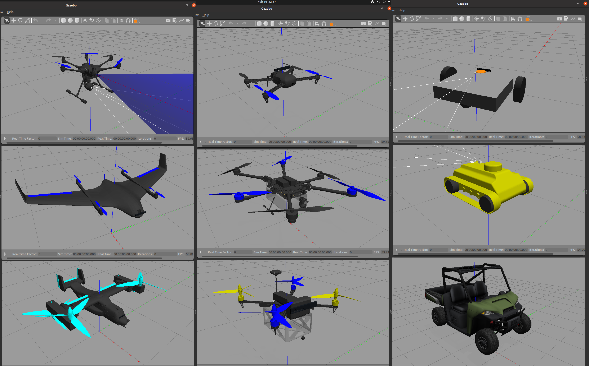
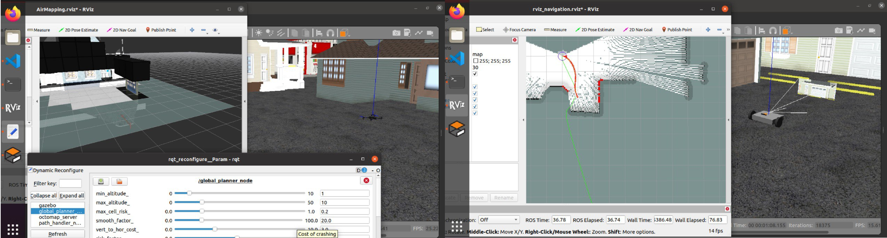

# This is the project contains Gazebo SITL control for multiple vehicles

# Inroduction

The project contains autonomous Unmanned Aerial Vehicles (UAVs) and cars with PX4 autopilot software. It provides a folder for Software in the Loop (SITL), Hardware in the Loop (HITL), and a folder for real autonomous vehicles. The setup is for Ubuntu 20.04.5 and ROS Noetic. Some realizations in this project are:

- Custom models and configuration in Gazebo for PX4
- QGroundControl compatible and automatic mission accomplishment
- Automatic mission with avoidance algorithms
- Swarm missions

# User Guide

Mavros SITL for Multiple Vehicles can be easily set up using PX4 SITL Gazebo and MAVROS. By following the steps outlined below, you can create a multi-vehicle simulation and do the multiple vehicles tasks in the simulation.

Before we can run on the real vehicles, it's good to test on the simulation enviroment first. To simulate multiple vehicles in Gazebo, we need to set up PX4 SITL Gazebo. Here are the guide steps to set it up:

[Installing the Desktop Ubuntu for the simulation](docs/InstallDesktop.md)

[Installing the Pixhawk Autopilot](docs/InstallAutopilot.md)

[Working with SITL](docs/ManualSITL.md)

[Working with HITL](docs/ManualHITL.md)

Once we have set up and tested the simulation, we can implement everything in the real-world applications. Here are the steps to setup and control on the companion computer:

[Installing the Server Ubuntu on the companion computer](docs/InstallRPI.md)

[Working with Raspberry Pi](docs/ManualRPI.md)

Here are some example use cases for the realizations in the project:

### Custom models and enviroments
The project provides several PX4-based models, including drones, rovers, and VTOLs. There are 13 available world environments to choose from. Custom models and environments can be created as well.

### UAV with avoidance module:
To use automatic mission with avoidance packages, the PX4 computer vision algorithms packaged as ROS nodes can be used for depth sensor fusion and obstacle avoidance. The project includes a UAV with avoidance module, which can be used for this purpose.

### UAV or ground vehicle swarm:
For UAV or ground vehicle swarm missions, the "swarms" package provides swarm mission planning and execution tools. These tools allow you to plan and execute missions involving multiple drones.

# Licence

This software is released under the permissive BSD 3-clause license, which allows users to modify and distribute the software as long as they provide attribution and don't use the PX4 trademark without permission.

