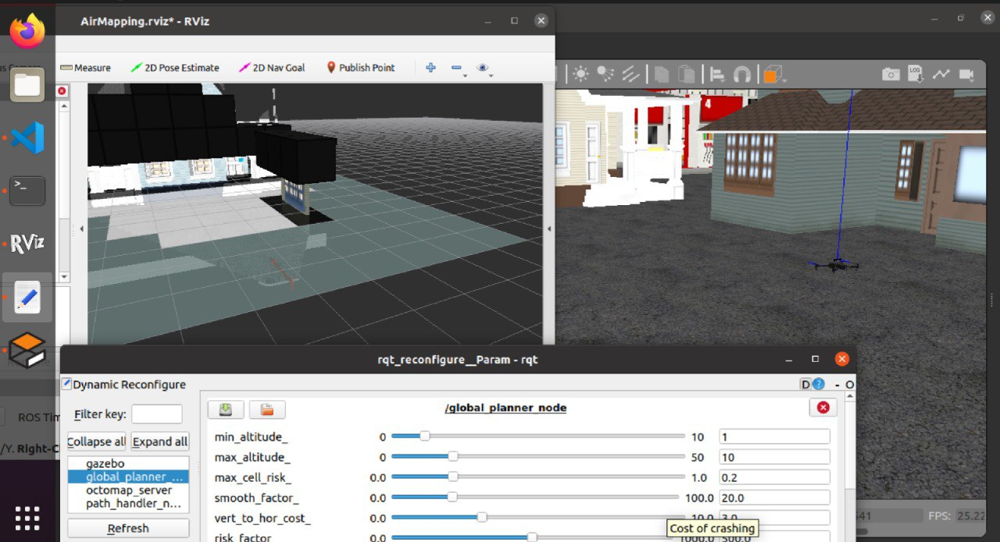
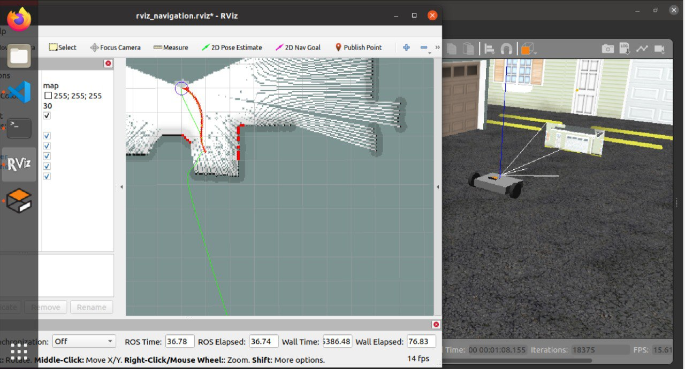
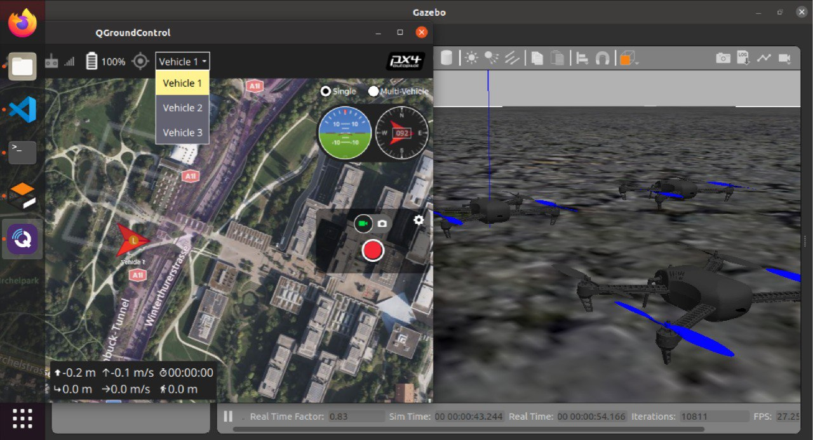
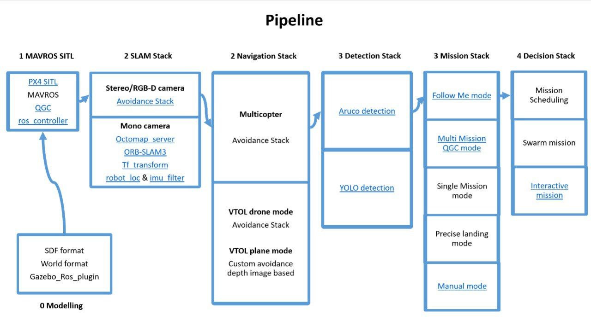
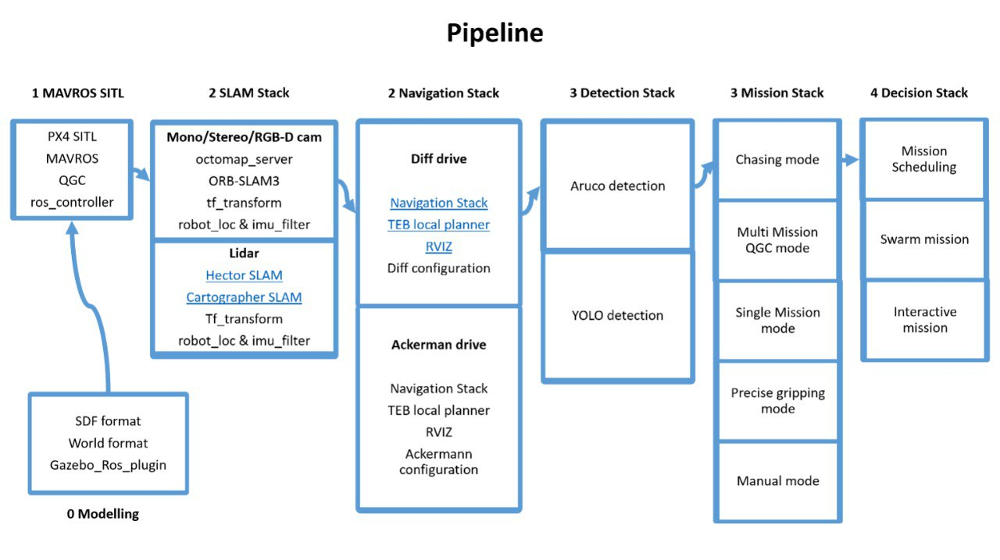

# This is the project contains Gazebo SITL control for multiple vehicles

# User Guide

[Installing the Desktop Ubuntu for the simulation](docs/InstallDesktop.md)

[Installing the Pixhawk Autopilot](docs/InstallAutopilot.md)

[Installing the Server Ubuntu on the companion computer](docs/InstallRPI.md)

[Working with SITL](docs/ManualSITL.md)

[Working with HITL](docs/ManualHITL.md)

[Working with Raspberry Pi](docs/ManualRPI.md)

# Inroduction

This project contains autonomous UAVs and cars with PX4 autopilot software.
The folder is provided SITL(Software in the loop), HITL(Hardware in the loop) and folder for the real autonomous too. All the setup is for Ubuntu 20.04.5 and ROS Noetic.

Some realization in this project:

- custom models and configuration in Gazebo for PX4
- Q Ground Control compatible and automatic mission accomplishment
- Automatic mission with avoidance algorithms
- Swarm mission

Examples:

#### UAV with avoidance module

#### Ground vehicle with avoidance module

#### UAV or ground vehicle swarm

#### UAV pipeline

#### Ground vehicle pipeline

# Licence

Free to use free to modify

