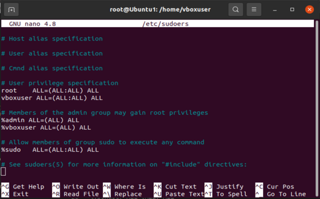

# Installing Ubuntu 20.04 Desktop Guide


#### Install a virtual box in your PC (optional)

I will provide some recoureces for windows users. If you are using Linux then you can skip some guides.

See the instruction from another resources to install virtualbox with Ubuntu 20.04

https://www.virtualbox.org/wiki/Downloads

If the problem appeard with permission for user:

open the terminal:

```bash
su root
nano /etc/sudoers
```
Write in there this codes
```bash
vboxuser ALL=(ALL:ALL) ALL
%vboxuser ALL=(ALL) ALL
```



Save the file and write "exit"

#### Install ROS

```bash
sudo apt update
```
```bash
sudo apt install git python3-pip python3-schedule -y
```
```bash
mkdir -p ~/catkin_ws/src
cd ~/catkin_ws/src
git clone https://github.com/TPODAvia/ROS1-installation.git
chmod +x ROS1-installation/ROS.sh
sudo ./ROS1-installation/ROS.sh
```
```bash
echo "source /opt/ros/noetic/setup.bash" >> ~/.bashrc
source ~/.bashrc
source /opt/ros/noetic/setup.bash
# sudo apt install xterm build-essential python3-rosdep -y
sudo apt-get install xterm build-essential python3-rosdep ros-noetic-hector-slam libpcl1 ros-noetic-octomap-* -y
# sudo apt install libpcl1 ros-noetic-octomap-* -y
```

#### Install YOLOv8 dependencies

```bash
sudo apt-get install python3-scipy ros-noetic-vision-msgs ros-noetic-geometry-msgs ros-noetic-usb-cam -y
# sudo apt-get install ros-noetic-vision-msgs -y
# sudo apt-get install ros-noetic-geometry-msgs -y
# sudo apt-get install ros-noetic-usb-cam -y
```

#### Install the workspace
```bash
cd ~/catkin_ws
catkin_make
echo "source ~/catkin_ws/devel/setup.bash" >> ~/.bashrc
source ~/.bashrc
```
```bash
cd ~/catkin_ws/src

git clone https://github.com/TPODAvia/yolov8_ros.git
git clone https://github.com/okalachev/vl53l1x_ros
git clone https://github.com/machinekoder/ar_track_alvar.git -b noetic-devel

git init
git remote add origin https://github.com/TPODAvia/PX4-Autonomous-Vehicle.git
git pull origin main
```

```bash
cd ~/catkin_ws
source /opt/ros/noetic/setup.bash
sudo rosdep init
```
```bash
rosdep update
rosdep install --from-paths src --ignore-src -y
```
```bash
sudo /usr/bin/python3 -m pip install -r ~/catkin_ws/src/requirements.txt
sudo /usr/bin/python3 -m pip install -r ~/catkin_ws/src/yolov8_ros/requirements.txt
```
#### Install PX4-Autopilot
```bash
cd
git clone --recursive --depth 1 --branch v1.13.3 https://github.com/PX4/PX4-Autopilot.git ~/PX4-Autopilot

pip3 install --user toml
pip3 install kconfiglib
pip3 install --user jsonschema
# sudo apt install gcc-arm-none-eab
sudo apt install libopencv-dev python-jinja2 protobuf-compiler -y
sudo /opt/ros/noetic/lib/mavros/install_geographiclib_datasets.sh

~/PX4-Autopilot/Tools/setup/ubuntu.sh
# export GAZEBO_RESOURCE_PATH=/usr/share/gazebo-11

cd ~/PX4-Autopilot
#make px4_sitl_default
make px4_sitl gazebo
```
go to the .barcsh and add at the end files and save it:
```bash
sudo nano ~/.bashrc
```
---------------------------------------------------------------------------------
```bash
. ~/PX4-Autopilot/Tools/setup_gazebo.bash ~/PX4-Autopilot ~/PX4-Autopilot/build/px4_sitl_default

export GAZEBO_MODEL_PATH=${GAZEBO_MODEL_PATH}:~/catkin_ws/src/PX4-Avoidance/avoidance/sim/models:~/catkin_ws/src/px4_sim/models:~/catkin_ws/src/PX4-Avoidance/avoidance/sim/worlds:~/catkin_ws/src/px4_sim/worlds

export GAZEBO_PLUGIN_PATH=$GAZEBO_PLUGIN_PATH:/usr/lib/x86_64-linux-gnu/gazebo-11/plugins

export ROS_PACKAGE_PATH=${ROS_PACKAGE_PATH}:~/PX4-Autopilot

export ROS_PACKAGE_PATH=${ROS_PACKAGE_PATH}:~/PX4-Autopilot/Tools/sitl_gazebo

```
---------------------------------------------------------------------------------

In the end of bashrc you should see this:


```bash
cd ~/catkin_ws
source devel/setup.bash
catkin_make
```

#### Install QGroundControl
```bash
cd
sudo usermod -a -G dialout $USER
sudo apt-get remove modemmanager -y
sudo apt install gstreamer1.0-plugins-bad gstreamer1.0-libav gstreamer1.0-gl libqt5gui5 libfuse2 -y
# sudo apt install libqt5gui5 -y
# sudo apt install libfuse2 -y
xdg-open https://d176tv9ibo4jno.cloudfront.net/latest/QGroundControl.AppImage
```
wait for some seconds
```bash
cd
cp ./Downloads/QGroundControl.AppImage ~/QGroundControl.AppImage
chmod +x ./QGroundControl.AppImage
```

#### Install UI
```bash

sudo apt install zenity

# sudo apt install yad
# sudo apt-get install libcanberra-gtk-module
# sudo apt-get install libcanberra-gtk-module:i386
# sudo apt-get install --reinstall libcanberra-gtk-module

```

Close and restart your Ubuntu:
```bash
sudo reboot
```
