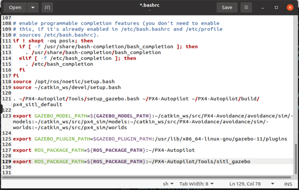

# Installing Ubuntu 20.04 Desktop Guide


#### Install a virtual box in your PC (optional)

I will provide some recoureces for windows users. If you are using Linux then you can skip some guides.

See the instruction from another resources to install virtualbox with Ubuntu 20.04

https://www.virtualbox.org/wiki/Downloads

If the problem appeard with permission for user:

open the terminal:

```
su root
nano /etc/sudoers
```
Write in there this codes
```
vboxuser ALL=(ALL:ALL) ALL
%vboxuser ALL=(ALL) ALL
```


Save the file and write "exit"

#### Install ROS

```
sudo apt update
```
```
sudo apt install git python3-pip -y
```
```
mkdir -p ~/catkin_ws/src
cd ~/catkin_ws/src
git clone https://github.com/TPODAvia/ROS1-installation.git
chmod +x ROS1-installation/ROS.sh
sudo ./ROS1-installation/ROS.sh
echo "source /opt/ros/noetic/setup.bash" >> ~/.bashrc
source ~/.bashrc
source /opt/ros/noetic/setup.bash
```
```
sudo apt install build-essential python3-rosdep -y
sudo apt-get install ros-noetic-hector-slam -y
sudo apt install libpcl1 ros-noetic-octomap-* -y
```

#### Install YOLOv8 dependencies

```
sudo apt-get install python3-scipy -y
sudo apt-get install ros-noetic-vision-msgs -y
sudo apt-get install ros-noetic-geometry-msgs -y
sudo apt-get install ros-noetic-usb-cam -y
```

#### Install the workspace
```
cd ~/catkin_ws
catkin_make
echo "source ~/catkin_ws/devel/setup.bash" >> ~/.bashrc
source ~/.bashrc
```
```
cd ~/catkin_ws/src

git clone https://github.com/TPODAvia/yolov8_ros.git
git clone https://github.com/okalachev/vl53l1x_ros
git clone https://github.com/machinekoder/ar_track_alvar.git -b noetic-devel

git init
git remote add origin https://github.com/TPODAvia/PX4-Autonomous-Vehicle.git
git pull origin main
```

```
cd ~/catkin_ws
source /opt/ros/noetic/setup.bash
sudo rosdep init
```
```
rosdep update
rosdep install --from-paths src --ignore-src -y
```
```
sudo /usr/bin/python3 -m pip install -r ~/catkin_ws/src/requirements.txt
sudo /usr/bin/python3 -m pip install -r ~/catkin_ws/src/yolov8_ros/requirements.txt
```
#### Install PX4-Autopilot
```
cd
git clone https://github.com/PX4/PX4-Autopilot.git --recursive

pip3 install --user toml
pip3 install kconfiglib
pip3 install --user jsonschema
# sudo apt install gcc-arm-none-eab
sudo apt install libopencv-dev python-jinja2 protobuf-compiler -y
sudo /opt/ros/noetic/lib/mavros/install_geographiclib_datasets.sh

~/PX4-Autopilot/Tools/setup/ubuntu.sh
# export GAZEBO_RESOURCE_PATH=/usr/share/gazebo-11
make px4_sitl gazebo-classic
```
go to the .barcsh and add at the end files and eve it:

---------------------------------------------------------------------------------
```
. ~/PX4-Autopilot/Tools/simulation/gazebo-classic/setup_gazebo.bash ~/PX4-Autopilot ~/PX4-Autopilot/build/px4_sitl_default

export GAZEBO_MODEL_PATH=${GAZEBO_MODEL_PATH}:~/catkin_ws/src/PX4-Avoidance/avoidance/sim/models:~/catkin_ws/src/PX4-Avoidance/avoidance/sim/worlds

export ROS_PACKAGE_PATH=${ROS_PACKAGE_PATH}:~/PX4-Autopilot
```
---------------------------------------------------------------------------------

In the end of bashrc you should see this:



```
cd ~/catkin_ws
source devel/setup.bash
catkin_make
```

#### Install QGroundControl
```
cd
sudo usermod -a -G dialout $USER
sudo apt-get remove modemmanager -y
sudo apt install gstreamer1.0-plugins-bad gstreamer1.0-libav gstreamer1.0-gl -y
sudo apt install libqt5gui5 -y
sudo apt install libfuse2 -y
xdg-open https://d176tv9ibo4jno.cloudfront.net/latest/QGroundControl.AppImage
```
wait for some seconds
```
cd
cp ./Downloads/QGroundControl.AppImage ~/QGroundControl.AppImage
chmod +x ./QGroundControl.AppImage
```

Close and restart your Ubuntu:
```
sudo reboot
```