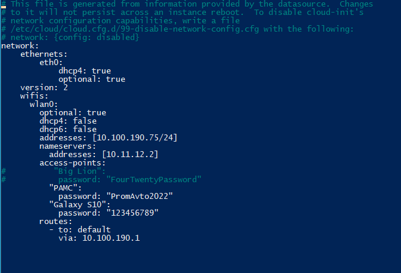
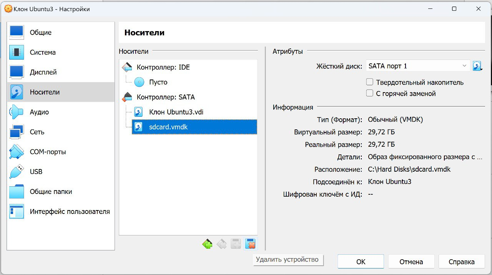

# Install Ubuntu 20.04 Server for the companion computer 

## Build from our Raspberry Pi images

There are several 2 ways to build raspberry pi system. Easiest of courece is to download the image that we are provided.

We are tested and provided several images (https://drive.google.com/drive/folders/1ff6Cl5y6kWvpjLPnML8qoepN1H--mvBu?usp=share_link):
- Raspberry Pi Model 4B 4G RAM
- Raspberry Pi Model 3B

## Build from Source(optional)

#### Install the image ubuntu 20.04 server for raspberry
https://cdimage.ubuntu.com/releases/focal/release/


#### To connect to local wifi network run:

```bash
sudo nano /etc/netplan/50-cloud-init.yaml
```
add this line to the file:
```bash
wifis:
  wlan0:
    optional: true
    access-points:
        "your-ssid":
            password: "pass"
    dhcp4: true
```


After this, open terminal and note your IP address. The the setting can be modified:
```bash
wifis:
  wlan0:
    optional: true
    dhcp4: false
    dhcp6: false
    addresses: ["your-IP-address"/24]
    nameservers:
      addresses: [10.11.12.2]
    access-points:
        "your-ssid":
            password: "pass"
    routes:
      - to: default
        via: 10.100.190.1
```
where 10.11.12.2 is your DNS server IP, and 10.100.190.1 is your router IP.
The yaml should look like this:



#### We should check the sintax for the errors
```bash
sudo netplan -debug generate
```

#### To connect to desktop with Ethernet cable:
Both desktop and Raspberry Pi should have IP adresses from the range 169.254.x.x to be ready to connect via ssh. You can verify IP adresses with this commands:
for Windows
```bash
ipconfig
```
and for Linux (may require net-tools to be installed)
```bash
ifconfig -a
```
other options:
```bash
ip a
ip addr show
hostname -I
```

#### We need to mofify terminal UI for the colorful visualization:
```bash
ls -la ~/ | more
 nano ~/.bashrc
```
uncomment the line: 
```bash
force_color_prompt=yes
```
press "ctrl + x", press "y", press "enter", write in terminal: exit

#### Encrease swap file:
See this instructions for the details
https://www.digitalocean.com/community/tutorials/how-to-add-swap-space-on-ubuntu-20-04

Restart the device
```bash
sudo reboot
```

### SSH control

Install the Putty software to your desktop
https://www.putty.org/

Connect to ssh with IP: 192.168.1.6


#### Install ROS
```bash
sudo apt update
```
```bash
sudo apt install git python3-pip python3-schedule i2c-tools python3-smbus -y
```
```bash
mkdir -p ~/catkin_ws/src
cd ~/catkin_ws/src
git clone https://github.com/TPODAvia/ROS1-installation.git
chmod +x ROS1-installation/ROS_server.sh
sudo ./ROS1-installation/ROS_server.sh
```
```bash
echo "source /opt/ros/noetic/setup.bash" >> ~/.bashrc
source ~/.bashrc
source /opt/ros/noetic/setup.bash
sudo apt install xterm pi-bluetooth -y
sudo apt install build-essential python3-rosdep ros-noetic-hector-slam libpcl1 ros-noetic-octomap-* -y
# sudo apt-get install ros-noetic-hector-slam -y
# sudo apt install libpcl1 ros-noetic-octomap-* -y
```
#### Enable I2C connection
```bash
sudo nano /lib/udev/rules.d/60-i2c-tools.rules
```

Change Mode from "0660" to "0666":
```bash
KERNEL=="i2c-[1-9]*", GROUP="i2c", MODE="0666"
```

#### Install YOLOv8 dependencies

```bash
sudo apt-get install python3-scipy ros-noetic-vision-msgs ros-noetic-geometry-msgs -y
# sudo apt-get install ros-noetic-vision-msgs -y
# sudo apt-get install ros-noetic-geometry-msgs -y
```

#### Install the workspace
```bash
cd ~/catkin_ws
catkin_make
echo "source ~/catkin_ws/devel/setup.bash" >> ~/.bashrc
source ~/.bashrc
```
```bash
cd ~/catkin_ws/src

git clone https://github.com/TPODAvia/yolov8_ros.git
git clone https://github.com/okalachev/vl53l1x_ros
git clone https://github.com/machinekoder/ar_track_alvar.git -b noetic-devel

git init
git remote add origin https://github.com/TPODAvia/PX4-Autonomous-Vehicle.git
git pull origin main
```

```bash
cd ~/catkin_ws
source /opt/ros/noetic/setup.bash
sudo rosdep init
```
Now we need to delete gazebo-related package because it's not neeeded here
```bash
sudo rm -r src/px4_sim
sudo rm -r src/world_sim
sudo rm -r src/mavros_humantracking
```
```bash
rosdep update
rosdep install --from-paths src --ignore-src -y
```
```bash
sudo /usr/bin/python3 -m pip install -r ~/catkin_ws/src/requirements.txt
sudo /usr/bin/python3 -m pip install -r ~/catkin_ws/src/yolov8_ros/requirements.txt
```

```bash
cd ~/catkin_ws
source devel/setup.bash
catkin_make -j1
```

#### Install QGroundControl

```bash
cd
sudo /opt/ros/noetic/lib/mavros/install_geographiclib_datasets.sh
```

#### WIFI setup

```bash
cd ~/catkin_ws/src/swarms/
sudo wifi-hotspot.sh
```

#### I2C communication setup

[Setting 9250 IMU module with I2C](docs/IMU9250I2C.md)

#### Flash Arduino via ssh

[Setting Raspberry Pi with Arduino](docs/InstallArduino.md)

#### Custom image building for the Ubuntu Server

For Linux users there are really simple instructions on the internet how to do it but for Windows users there are some "hacks" how we can create an image backup for our companion computer

Go to the cmd and type:
```
"C:\Program Files\Oracle\VirtualBox\VBoxManage" internalcommands createrawvmdk -filename "c:/Hard Disks/sdcard.vmdk" -rawdisk "\\.\PHYSICALDRIVE1"
```


Go to Ubuntu:
install GParted
```bash
sudo apt install gparted
```
Resize image there


Switch back to Windows and install "win32 disk imager". It's a simple way to create backup file.

Remember to check "Read Only Allocated Partitions"


#### Delete disk location

To delete the link to an SD card in VirtualBox, you can follow these steps:

- Open the VirtualBox Disk Manager.

- Locate the sdcard.vmdk file in the list.

- Select the sdcard.vmdk file and click on the "Remove" or "Delete" button.



From cmd excecute this line of code:

"C:\Program Files\Oracle\VirtualBox\VBoxManage" closemedium "C:\Hard Disks\sdcard.vmdk" --delete


### Always On mode

To disable the sleep mode and allow automatic login in Ubuntu using the terminal, follow the steps below:

1. **Disable Sleep Mode**

To disable the sleep mode in Ubuntu, you can use the `systemctl` command to mask the sleep, suspend, hibernate, and hybrid-sleep targets. This essentially links these unit files to /dev/null, making it impossible for the system to start them [Source 2](https://askubuntu.com/questions/47311/how-do-i-disable-my-system-from-going-to-sleep).

You can execute the following command:

```bash
sudo systemctl mask sleep.target suspend.target hibernate.target hybrid-sleep.target
```

Keep in mind that this command will completely disable sleep mode, meaning your system will stay awake indefinitely until you manually put it to sleep or shut it down.

2. **Enable Automatic Login**

To enable automatic login, you'll need to edit the `custom.conf` file in the `/etc/gdm3/` directory. Here is how you can do it:

First, open the file using a text editor such as `nano`.

```bash
sudo nano /etc/gdm3/custom.conf
```

Find the section in the file labeled `[daemon]`. In this section, uncomment (or add if it's not there) the line `AutomaticLoginEnable=true` and the line `AutomaticLogin=[your username]`, replacing `[your username]` with your actual username.

Here is how it should look:

```bash
[daemon]
AutomaticLoginEnable=true
AutomaticLogin=john_doe
```

After making the changes, press `Ctrl+X` to exit and `Y` to save the changes. Then, restart your system for the changes to take effect.

Please note that enabling automatic login can pose a security risk as anyone who can access your computer will be able to turn it on and have immediate access to your files and data.

3. **Handle Lid Close Action**

In some cases, you might want to change the action that Ubuntu takes when the laptop lid is closed. To do this, you can edit the `/etc/systemd/logind.conf` file [Source 9](https://www.dell.com/support/kbdoc/en-us/000179566/how-to-disable-sleep-and-configure-lid-power-settings-for-ubuntu-or-red-hat-enterprise-linux-7).

Open the file using a text editor:

```bash
sudo nano /etc/systemd/logind.conf
```

Find the line that starts with `#HandleLidSwitch=suspend` and change it to `HandleLidSwitch=ignore`. This will make Ubuntu do nothing when the laptop lid is closed.

Here is how it should look:

```bash
HandleLidSwitch=ignore
```

To prevent Ubuntu from going into suspend mode and turning on the lock screen, you can use the following steps:

4. **Disable Automatic Lock Screen**

To disable the automatic lock screen, you need to change the settings of the GNOME desktop. You can do this using the `gsettings` command. The following command will disable the lock screen:

```bash
gsettings set org.gnome.desktop.session idle-delay 0
gsettings set org.gnome.desktop.screensaver lock-enabled false
```

This command will prevent the lock screen from appearing due to inactivity [Source 2](https://askubuntu.com/questions/1029696/disable-password-request-from-suspend-18-04).

5. **Disable Lock Screen Upon Suspend**

In addition to disabling the automatic lock screen, you may also want to disable the lock screen that appears after your system wakes up from suspend. You can do this with the following `gsettings` command:

```bash
gsettings set org.gnome.desktop.screensaver ubuntu-lock-on-suspend false
```

This command will prevent the lock screen from appearing after suspend [Source 2](https://askubuntu.com/questions/1029696/disable-password-request-from-suspend-18-04).


After making the change, save and close the file, then restart the `systemd-logind` service by running:

```bash
sudo reboot
```

Please keep in mind that these changes should be made carefully as they can significantly alter the behavior of your system. Always make sure to backup any files you edit in case you need to revert the changes.
Again, please note that disabling the lock screen and suspend mode can pose a security risk. Anyone with access to your computer will be able to use it without having to enter a password. Please use these commands responsibly.


6. **Watchdog**

To enable the watchdog timer on your Raspberry Pi running Ubuntu 22.04, you can follow the steps below:

1. Activate the hardware watchdog on your Raspberry Pi. In your `config.txt` file, add the following line to enable the watchdog:

```bash
dtparam=watchdog=on
```
You can edit this file using the nano editor with the command `sudo nano /boot/config.txt`, then add the line above at the end of the file and save it [Source 7](https://medium.com/@arslion/enabling-watchdog-on-raspberry-pi-b7e574dcba6b).

2. Reboot your Raspberry Pi. After the reboot, you can check if the watchdog is enabled by running the command `ls -al /dev/watchdog*`. You should see output similar to this:

```bash
crw------- 1 root root  10, 130 May 19 07:09 /dev/watchdog
crw------- 1 root root 253,   0 May 19 07:09 /dev/watchdog0
```
This indicates that the watchdog is enabled [Source 7](https://medium.com/@arslion/enabling-watchdog-on-raspberry-pi-b7e574dcba6b).

3. Install the watchdog software package with the command `sudo apt-get install watchdog` [Source 1](https://forums.raspberrypi.com//viewtopic.php?t=147501).

4. Configure the watchdog package. Edit the configuration file `/etc/watchdog.conf` and uncomment or add the following lines:

```bash
max-load-1 = 24
min-memory = 1
watchdog-device = /dev/watchdog
watchdog-timeout=15
```
You can edit this file using the nano editor with the command `sudo nano /etc/watchdog.conf`, then make the changes and save the file [Source 7](https://medium.com/@arslion/enabling-watchdog-on-raspberry-pi-b7e574dcba6b).

5. Start the watchdog service with the command `sudo systemctl start watchdog` and enable it to start at boot with the command `sudo systemctl enable watchdog` [Source 7](https://medium.com/@arslion/enabling-watchdog-on-raspberry-pi-b7e574dcba6b).

6. Verify that the watchdog service is running with the command `sudo systemctl status watchdog`. If it's running correctly, you should see output indicating that the service is active [Source 1](https://forums.raspberrypi.com//viewtopic.php?t=147501).

With these steps, you should have successfully enabled the watchdog timer on your Raspberry Pi running Ubuntu 22.04. The watchdog timer will help to automatically reboot the system in case it freezes.


Ubuntu Server uses Netplan to manage its connections.

To create an access point using Netplan, you can do the following:
#### 1. Install Network Manager

```bash
sudo apt update
sudo apt install network-manager
```

#### 2. Disable cloud-init

```bash
sudo bash -c "echo 'network: {config: disabled}' > /etc/cloud/cloud.cfg.d/99-disable-network-config.cfg"
```

####  3. Create a Netplan configuration

```bash
sudo nano /etc/netplan/50-cloud-init.yaml
```
Then add the following configuration:

```bash
network:
  version: 2
  renderer: NetworkManager
  ethernets:
    eth0:
      dhcp4: true
      optional: true
  wifis:
    wlan0:
      dhcp4: true
      optional: true
      access-points:
        "Raspberry":
          password: "12345678"
          mode: ap
        "Additional_WIFI_Name_1":
          password: "12345678"
        "Additional_WIFI_Name_2":
          password: "12345678"
```
You can change the access point name "Raspberry" and the password to your liking.

Then save the file using CTRL+X.
####  4. Apply the Netplan configuration

Finally, use use the following commands to apply your new configuration:

```bash
sudo netplan generate
sudo netplan apply
sudo reboot
```
A new wireless access point should be created. It has DHCP and DNS enabled by default, and if the Pi has internet access over Ethernet, it'll be shared over the WiFi hotspot as well.

#### 5. To enable/disable Wifi 

Run this command:

The command template is look like this:
```bash
sudo nmcli c up/down your_wifi_name
```

This command is used to activate a hotspot connection:
```bash
sudo nmcli c up netplan-wlan0-Raspberry
```

To switch to others WiFi connection - run this
```bash
sudo nmcli c up Additional_WIFI_Name_1
```

```bash
sudo nmcli c down Additional_WIFI_Name_1
```

#### 6. To display a list of visible Wi-Fi networks:

```bash
nmcli d wifi list
```
```bash
nmcli connection show netplan-wlan0-Raspberry
```

#### 7. Bash script

The connections control can be wrapped to the bash script. The example are provided in the `bash` folder.