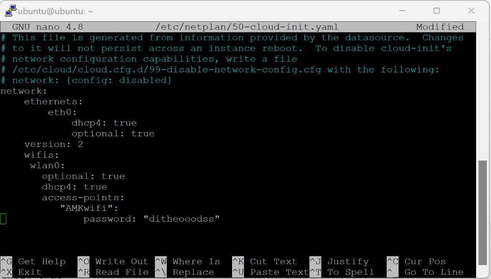
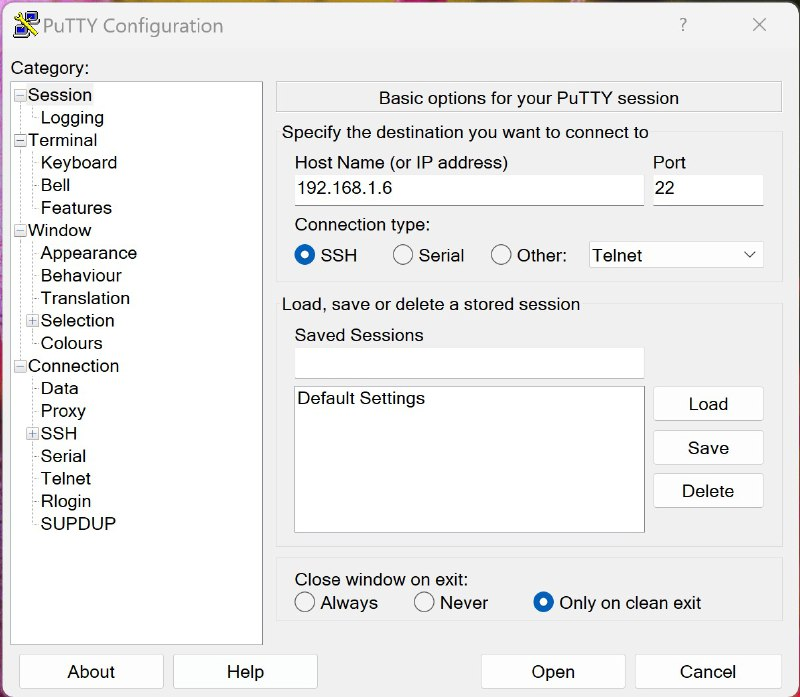
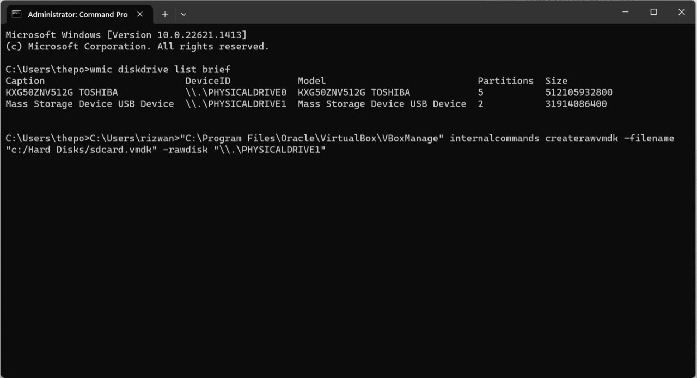
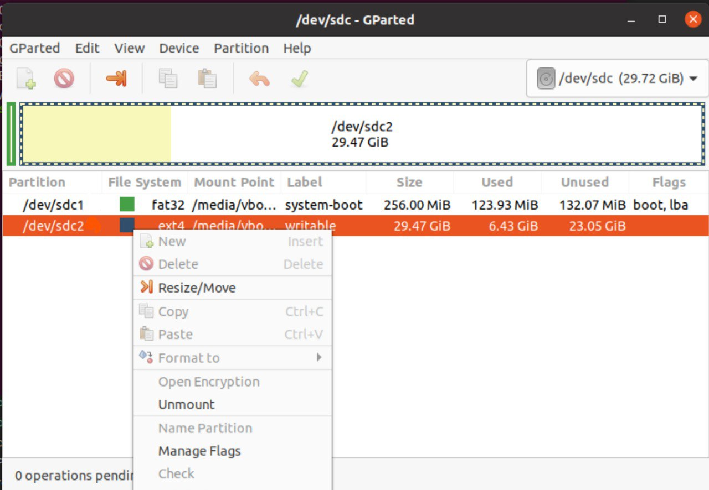
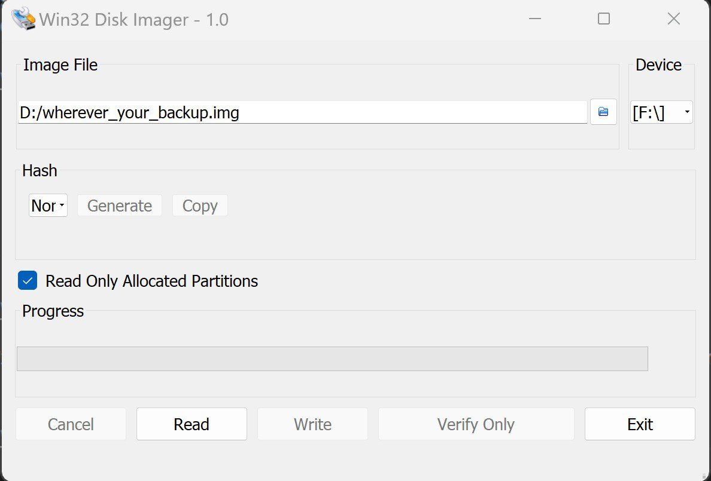

# Install Ubuntu 20.04 Server for the companion computer 

## Build from our Raspberry Pi images

There are several 2 ways to build raspberry pi system. Easiest of courece is to download the image that we are provided.

We are tested and provided several images:
- Raspberry Pi Model 4B 4G RAM
- Raspberry Pi Model 3B

## Build from Source(optional)

#### Install the image ubuntu 20.04 server for raspberry
https://cdimage.ubuntu.com/releases/focal/release/


#### To connecto to local wifi network run:

```s
sudo nano /etc/netplan/50-cloud-init.yaml
```
add this line to the file:
```s
wifis:
  wlan0:
    optional: true
    access-points:
        "your-ssid":
            password: "pass"
    dhcp4: true
```
The yaml should look like this:



#### We should check the sintax for the errors
```s
sudo netplan -debug generate
```
#### We need to mofify terminal UI for the colorful visualization:
```s
 nano ~/.bashrc
```
uncomment the line: 
```s
force_color_prompt=yes
```
press "ctrl + x", press "y", press "enter", write in terminal: exit

#### Encrease swap file:
See this instructions for the details
https://www.digitalocean.com/community/tutorials/how-to-add-swap-space-on-ubuntu-20-04

Restart the device
```s
sudo reboot
```

### SSH control

Install the Putty software to your desktop
https://www.putty.org/

Connect to ssh with IP: 192.168.1.6



#### Install ROS
```s
sudo apt update
```
```s
sudo apt install git python3-pip -y
```
```s
mkdir -p ~/catkin_ws/src
cd ~/catkin_ws/src
git clone https://github.com/TPODAvia/ROS1-installation.git
chmod +x ROS1-installation/ROS_server.sh
sudo ./ROS1-installation/ROS_server.sh
echo "source /opt/ros/noetic/setup.bash" >> ~/.bashrc
source ~/.bashrc
source /opt/ros/noetic/setup.bash
```
```s
sudo apt install build-essential python3-rosdep -y
sudo apt-get install ros-noetic-hector-slam -y
sudo apt install libpcl1 ros-noetic-octomap-* -y
```

#### Install YOLOv8 dependencies

```s
sudo apt-get install python3-scipy -y
sudo apt-get install ros-noetic-vision-msgs -y
sudo apt-get install ros-noetic-geometry-msgs -y
```

#### Install the workspace
```s
cd ~/catkin_ws
catkin_make
echo "source ~/catkin_ws/devel/setup.bash" >> ~/.bashrc
source ~/.bashrc
```
```s
cd ~/catkin_ws/src

# git clone https://github.com/TPODAvia/yolov8_ros.git
git clone https://github.com/okalachev/vl53l1x_ros
git clone https://github.com/machinekoder/ar_track_alvar.git -b noetic-devel

git init
git remote add origin https://github.com/TPODAvia/PX4-Autonomous-Vehicle.git
git pull origin main
```

```s
cd ~/catkin_ws
source /opt/ros/noetic/setup.bash
sudo rosdep init
```
Now we need to delete gazebo-related package because it's not neeeded here
```s
sudo rm -r px4_sim
sudo rm -r world_sim
```
```s
rosdep update
rosdep install --from-paths src --ignore-src -y
```
```s
sudo /usr/bin/python3 -m pip install -r ~/catkin_ws/src/requirements.txt
sudo /usr/bin/python3 -m pip install -r ~/catkin_ws/src/yolov8_ros/requirements.txt
```

```s
cd ~/catkin_ws
source devel/setup.bash
catkin_make
```

#### Install QGroundControl

```s
sudo /opt/ros/noetic/lib/mavros/install_geographiclib_datasets.sh
```

# Custom image building for the Ubuntu Server

For Linux users there are really simple instructions on the enternet how to do it but for Windows users there are some "hacks" how we can create an image backup for our companion computer

Go to the cmd and type:
```
"C:\Program Files\Oracle\VirtualBox\VBoxManage" internalcommands createrawvmdk -filename "c:/Hard Disks/sdcard.vmdk" -rawdisk "\\.\PHYSICALDRIVE1"
```


Go to Ubuntu:
install GParted
```s
sudo apt install gparted
```
Resize image there



Switch back to Windows and install "win32 disk imager". It's a simple way to create backup file.

Remember to check "Read Only Allocated Partitions"

