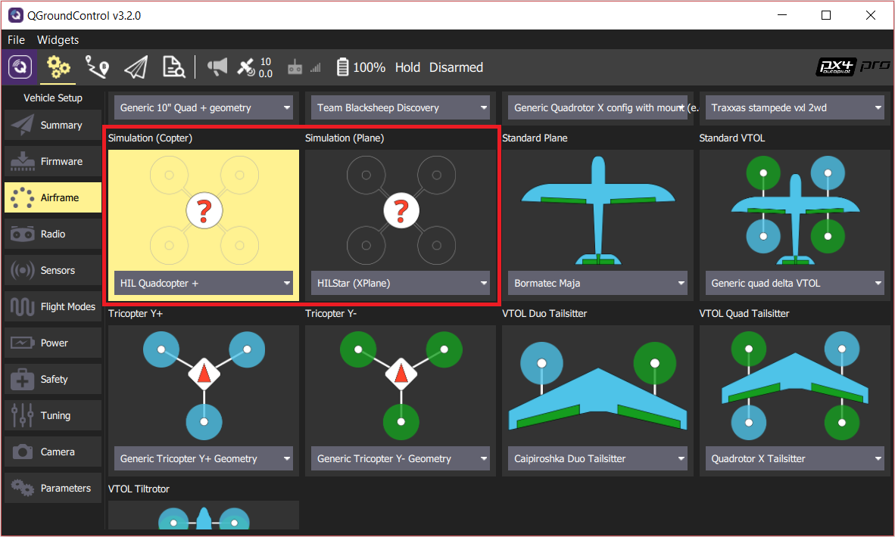

# HITL simulations

### Adding custom airframes
You can create custom airframe for HITL simulations and save them in airframe_hitl folder. Names of created airframe file should consist of number code followed by model name (e.g. 6011_typhoon_h480). After run in terminal: 

```s
ln -fs ~/catkin_ws/src/px4_sim/airframes_hitl/* ~/PX4-Autopilot/build/px4_sitl_default/etc/init.d-posix/airframes/
```

### Enabling motors in hitl
By default motors output is blocked in hitl mode. To unblock it, run in terminal:

```s
cd ~/catkin_ws/src/px4_sim/hitl_setup/
./hitl_setup
```
Follow the instructions of the script to achieve the desired state of operation of the motors.

### Building PX4 Software
To apply changes ypu need to build and upload px4 firmware onto flight-controller board. To build for NuttX- or Pixhawk- based boards, navigate into the PX4-Autopilot directory and then call `make` with the build target for your board.
For example, to build for Pixhawk 4 hardware you could use the following command:

```s
cd PX4-Autopilot
make px4_fmu-v5_default
```
A successful run will end with output similar to:

```s
-- Build files have been written to: /home/youruser/src/PX4-Autopilot/build/px4_fmu-v4_default
[954/954] Creating /home/youruser/src/PX4-Autopilot/build/px4_fmu-v4_default/px4_fmu-v4_default.px4
```
The first part of the build target `px4_fmu-v4` indicates the firmware for a particular flight controller hardware. The following list shows the build commands for the [Pixhawk standard](https://docs.px4.io/main/en/flight_controller/autopilot_pixhawk_standard.html) boards:

-Holybro Pixhawk 6X (FMUv6X): `make px4_fmu-v6x_default`

-Holybro Pixhawk 6C (FMUv6C): `make px4_fmu-v6c_default`

-Holybro Pix32 v6 (FMUv6C): `make px4_fmu-v6c_default`

-Holybro Pixhawk 5X (FMUv5X): `make px4_fmu-v5x_default`

-Pixhawk 4 (FMUv5): `make px4_fmu-v5_default`

-Pixhawk 4 Mini (FMUv5): `make px4_fmu-v5_default`

-CUAV V5+ (FMUv5): `make px4_fmu-v5_default`

-CUAV V5 nano (FMUv5): `make px4_fmu-v5_default`

-Pixracer (FMUv4): `make px4_fmu-v4_default`

-Pixhawk 3 Pro: `make px4_fmu-v4pro_default`

-Pixhawk Mini: `make px4_fmu-v3_default`

-Pixhawk 2 (Cube Black) (FMUv3): `make px4_fmu-v3_default`

-mRo Pixhawk (FMUv3): `make px4_fmu-v3_default` (supports 2MB Flash)

-Holybro pix32 (FMUv2): `make px4_fmu-v2_default`

-Pixfalcon (FMUv2): `make px4_fmu-v2_default`

-Dropix (FMUv2): `make px4_fmu-v2_default`

-Pixhawk 1 (FMUv2): `make px4_fmu-v2_default`

-Pixhawk 1 with 2 MB flash: `make px4_fmu-v3_default`


Build commands for non-Pixhawk NuttX fight controllers (and for all other-boards) are provided in the documentation for the individual [flight controller boards](https://docs.px4.io/main/en/flight_controller/).


> **Note**  The `_default` suffix is the firmware _configuration_. This is optional (i.e. you can also build using `make px4_fmu-v4`, `make bitcraze_crazyflie`, etc.).

### Uploading Firmware (Flashing the board)
Append `upload` to the make commands to upload the compiled binary to the autopilot hardware via USB. For example:
```s
make px4_fmu-v4_default upload
```
A successful run will end with this output:
```s
Erase  : [====================] 100.0%
Program: [====================] 100.0%
Verify : [====================] 100.0%
Rebooting.

[100%] Built target upload
```
### Setting up HITL
Select Airframe. To do this open **Setup --> *Airframes**
Select a compatible airframe you want to test. Generally you'll select _HILStar_ for Fixed Wing/X-Plane simulator and a _HIL QuadCopter_ option for copters (and jMAVSim or Gazebo). Then click **Apply and Restart** on top-right of the _Airframe_ _Setup_ page.


Calibrate your RC or Joystick, if needed. You can control simulation with a QGroundControl Virtual Joystick aswell.
Then setup **UDP** connection. Under the _General_ tab of the settings menu, uncheck all _AutoConnect_ boxes except for **UDP**. 


Now you can start gazebo HITL simulation. You should be able to use QGroundControl to run missions and otherwise control the vehicle.